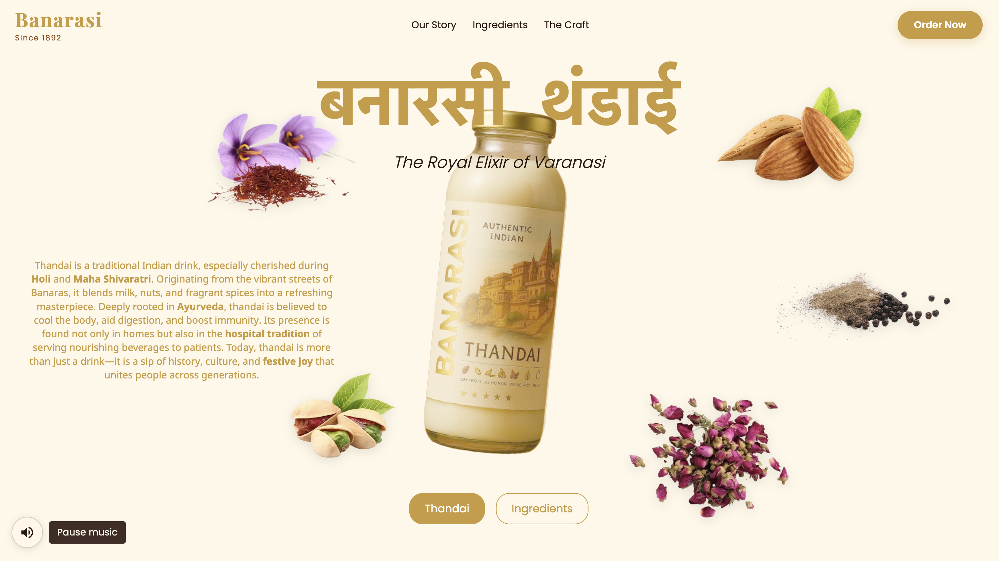

# 🥛 Banarasi

**Banarasi** is a modern digital concept for a **premium Thandai brand** — inspired by the rich heritage and authentic flavors of Banaras.  
This project is a **React-based website concept**, crafted to reflect tradition, purity, and a modern brand experience.  
The full-scale **Banarasi App** is scheduled to go live next year.

---

## 🌿 About the Brand

Banarasi celebrates the **art of Thandai** — a refreshing, festive, and soulful drink that has been a part of Indian culture for centuries.  
This concept website reimagines how traditional Indian beverages can be presented with a **modern, minimal, and elegant** digital identity.

The website focuses on:
- A clean, brand-centric design inspired by Banaras aesthetics.  
- Smooth transitions and responsive layouts.  
- A warm color palette that reflects purity and authenticity.  
- Scalable structure ready for e-commerce and mobile app integration.

---

## 🛠️ Tech Stack

- **React.js** – Component-driven frontend framework  
- **Vite** – Super-fast build tool  
- **CSS3** – Custom styling and layout  
- **Vanilla JS Animations / GSAP (optional)** – For brand motion and flow  

---

## 🚀 Future Plans

The upcoming **Banarasi App (2026)** will expand this concept into a full brand experience with:
- Product catalog and online ordering  
- Subscription and delivery model  
- Ingredient transparency and brand storytelling  
- Loyalty and seasonal festival features  

---

## 🧩 Current Status

🚧 *Concept Design Phase*  
This repository contains the **frontend prototype** created to visualize brand identity, UI flow, and user engagement for **Banarasi**.

---

## 👨‍💻 Author

**Developed by [Vishwajeet Kumar](https://github.com/kumarvishwajeettrivedi)**  
Freelance Frontend Engineer & Brand UI Designer  
> Crafting modern digital identities rooted in culture and experience.

---

## 🖼️ Preview

To include a brand preview image in your GitHub page, add this below (replace `banarasi.png` with your actual image):

```markdown

